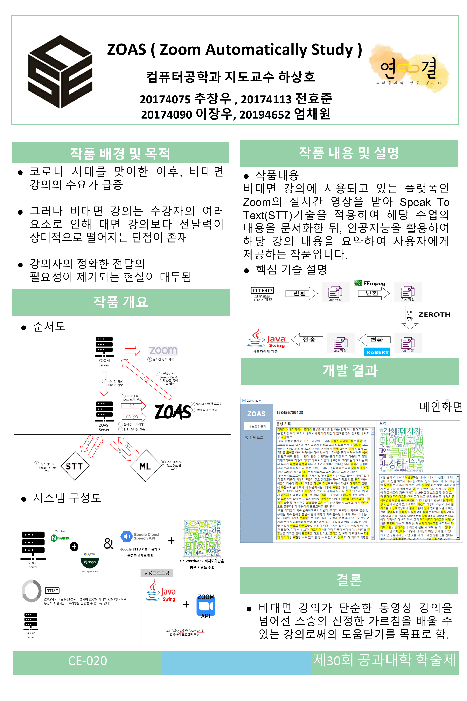
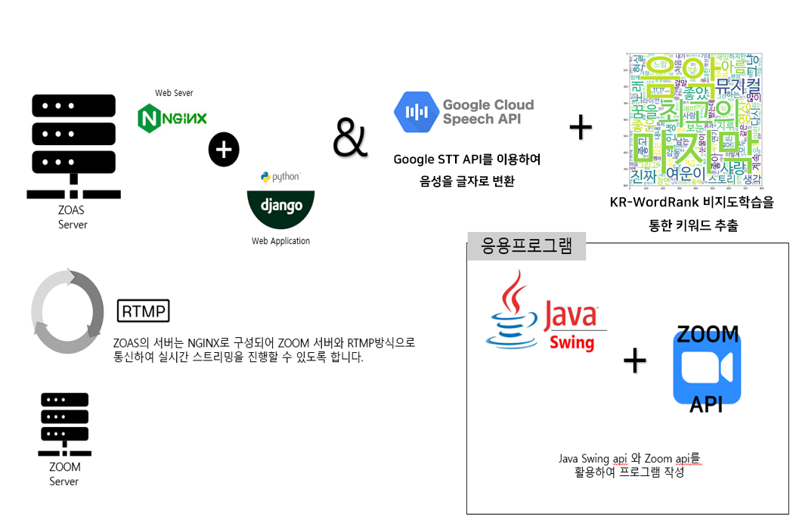
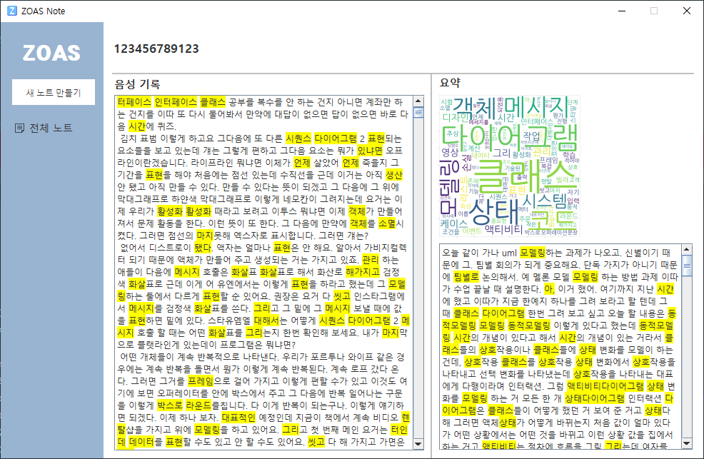

# ZOAS (Zoom As A Service / Zoom Assistant)

<!-- 프로젝트 주요 이미지 -->
### 프로젝트 소개 포스터

### 시스템 아키텍처 다이어그램

### 실제 데스크톱 앱 구동 화면

## 프로젝트 개요 (Project Overview)
ZOAS는 Zoom 화상 회의 플랫폼을 기반으로 실시간 스트리밍, 음성 인식(STT), 그리고 키워드 추출 기능을 제공하는 프로그램입니다. 화상 회의 중의 실시간 음성 데이터를 텍스트로 변환하고, 이를 분석하여 주요 키워드를 시각화(워드클라우드)하는 기능을 포함하고 있습니다.

## 아키텍처 및 주요 기술 (Architecture & Technologies)

프로젝트는 크게 클라이언트 응용 프로그램과 백엔드 서버 파트로 구성되어 있습니다.

### 1. 응용 프로그램 (Client Application)
- **언어 및 UI 프레임워크**: Java (Swing 및 JavaFX)
- **API 연동**: **Zoom API**를 활용하여 프로그램 내에서 Zoom 회의 기능과 연결합니다.

### 2. 서버 및 인프라 (Server & Infrastructure)
- **웹 서버 (Web Server)**: **NGINX**
  - ZOAS 서버는 NGINX로 구성되어, Zoom 서버와 **RTMP 방식**으로 통신하며 실시간 스트리밍을 진행할 수 있도록 합니다.
- **웹 애플리케이션 (Web Application)**: Python, **Django**

### 3. 데이터 처리 및 분석 (Data Processing & Analysis)
- **음성 인식 (STT)**: **Google Cloud Speech API**를 이용하여 실시간 음성을 텍스트(글자)로 변환합니다.
- **키워드 추출 (Keyword Extraction)**: **KR-WordRank** 비지도학습 알고리즘을 활용하여 텍스트에서 주요 키워드를 추출 및 워드클라우드 형태로 시각화합니다.
  - **KR-WordRank 레포지토리**: [https://github.com/lovit/KR-WordRank](https://github.com/lovit/KR-WordRank)
  - **오픈소스 기여 (Bugfix)**: 이 프로젝트를 진행하며 **KR-WordRank**의 `summarize_with_sentences` 등에서 단어별 가중치(Bias)를 할당할 때 발생하는 버그를 발견하고 수정하여 공식 레포지토리에 기여(PR #14)했습니다. 내부 HITS 알고리즘(PageRank)이 연산 시 문자열 단어가 아닌 인코딩된 정수(ID)를 키값으로 사용해야 한다는 점을 파악하여, 사용자가 전달한 Bias 딕셔너리를 내부 인코딩 체계에 맞게 변환(`token2int`)하여 적용되도록 로직을 개선했습니다. ([이슈 #13 참조](https://github.com/lovit/KR-WordRank/issues/13))

## 주요 기능 (Main Features)
- **노트 관리 UI**: '새 노트 만들기', '최근 노트', '전체 노트' 등을 확인하고 관리할 수 있는 직관적인 데스크톱 GUI 제공.
- **실시간 스트리밍 지원**: NGINX와 RTMP를 이용한 안정적인 Zoom 화상회의 스트리밍 연동.
- **회의 음성의 텍스트화 (STT)**: 회의 중 발생하는 음성을 텍스트로 자동 기록.
- **회의 요약 및 시각화**: 기록된 텍스트 데이터를 분석해 핵심 대화 주제를 워드클라우드로 선별하여 제공.

## 요구 사항 (Prerequisites)
- Java 11 이상 (JDK 11)
- Apache Maven
- Python 3.x (Django 패키지, KR-WordRank 패키지)
- NGINX
- Google Cloud Speech API 키 및 Zoom API 키
